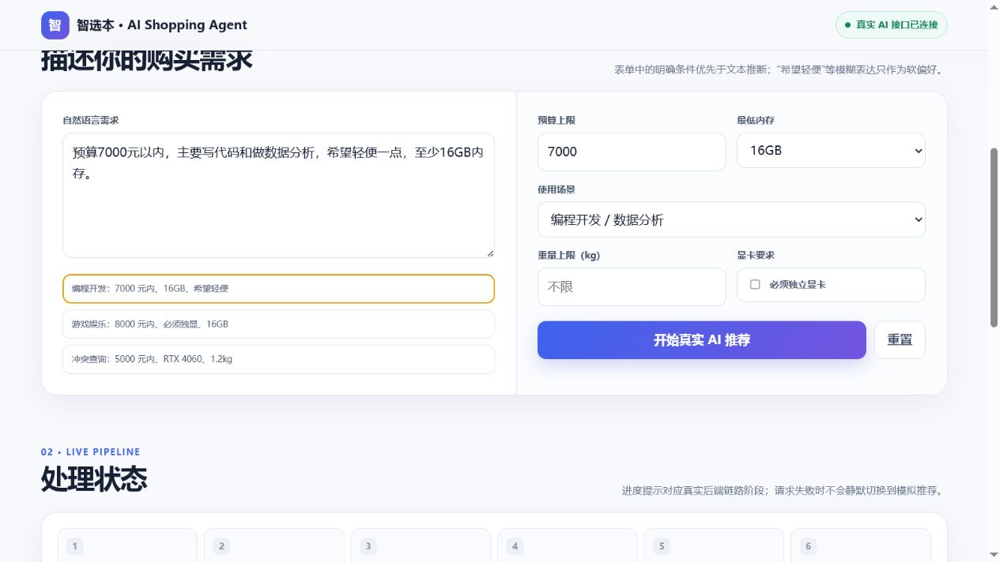
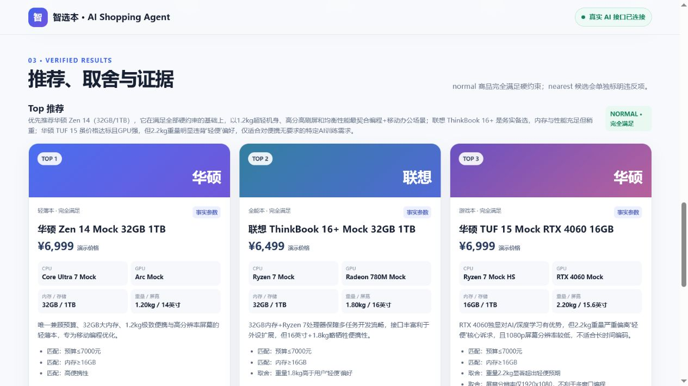
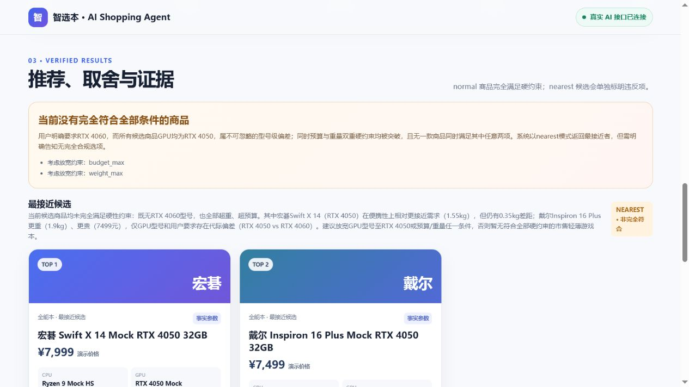

# 笔记本智能导购 Agent

## 项目简介与产品定位

本项目是一款面向笔记本电脑品类的智能导购应用。用户可以用自然语言和表单描述预算、性能、重量、内存及使用场景，系统输出可解释的商品推荐、取舍分析和证据来源。

项目采用“模型理解 + 规则决策”的混合架构：阿里云百炼千问负责理解需求和组织自然语言解释，确定性搜索引擎负责硬约束过滤、评分、排名和 nearest 冲突分析，避免让大模型随意决定商品名单。

> 当前 10 款商品和 30 条文档均为教学用 mock 数据，不代表实时市场价格或已核验商品信息。

## 在线地址

- GitHub 项目与在线文档：<https://github.com/DavidLYJ111/laptop-shopping-agent>
- 在线应用：<https://laptop-shopping-agent-ku1u.vercel.app>

## 产品截图与功能说明

### 1. 自然语言需求与结构化表单



页面显示“真实 AI 接口已连接”。用户可以输入自然语言，并补充预算、最低内存、使用场景、重量和显卡要求；表单中的明确条件优先于模型推断，“希望轻便”等模糊表达只保留为软偏好。

### 2. normal 模式推荐结果



系统先由千问提取结构化需求，再由确定性搜索引擎筛选完全满足硬约束的商品。页面展示固定排名、商品参数、匹配需求、取舍说明和检索证据；模型只能解释搜索结果，不能新增商品或修改排名。

### 3. nearest 模式冲突分析



当预算、重量和显卡要求无法同时满足时，系统不会伪造完全匹配结果，而是进入 nearest 模式，明确显示“非完全符合”、冲突原因、可放宽约束和最多两款最接近候选。

## 核心使用流程

1. 用户输入自然语言需求，也可以填写预算、内存、场景和重量等表单条件。
2. 第一次千问调用通过 JSON Mode 提取意图、硬约束和软偏好，结果必须通过 Pydantic 校验。
3. 表单中的明确条件以确定性规则覆盖模型提取结果。
4. `search_products` 执行硬约束过滤、场景评分、品牌多样性重排和 Top 3 输出。
5. 若没有完全满足的商品，系统返回最多 2 个 nearest 候选并列出违反条件。
6. 本地检索只允许 `fact` 和 `evidence` 文档进入模型上下文，排除 `derived`。
7. 第二次千问调用只为固定候选生成推荐解释，不得修改 SKU 或排名。
8. 服务端校验 SKU、排名、证据 ID、normal/nearest 语义和 mock 数据声明后返回页面。

## AI 如何介入

AI 只参与两个受约束阶段：

- 需求理解：把自然语言转换为 `IntentResult`，模糊表达保持为软偏好，不能擅自生成硬约束。
- 推荐表达：根据固定商品候选和实际检索证据生成推荐理由、取舍与比较总结。

商品过滤、候选名单、排名、违约数量和违反幅度全部由确定性 Python 代码计算。两个模型阶段都使用 JSON Mode，并经过 Pydantic Schema 校验；失败时最多纠正重试一次，不会无限调用模型或回退到伪装的模拟推荐。

## 技术栈

- 前端：单文件 HTML、CSS、JavaScript、Fetch API
- 后端：Python、FastAPI、Uvicorn
- 模型：阿里云百炼通义千问 `qwen-plus`
- 模型协议：OpenAI 兼容 Chat Completions、JSON Mode
- 数据与校验：Pydantic、JSONL
- 检索：本地关键词匹配，仅使用 `fact/evidence`
- 测试：Pytest、FastAPI TestClient
- 版本管理：Git、GitHub

## 项目目录

- `src/shopping_agent/agent/`：结构化 Schema、提示词、百炼适配和工作流编排
- `src/shopping_agent/api/`：FastAPI 入口、健康检查和推荐接口
- `src/shopping_agent/search/`、`scoring/`：确定性搜索、评分和 nearest 逻辑
- `src/shopping_agent/retrieval/`：本地可信证据检索
- `data/`：10 款 mock SKU、30 条文档及 JSON Schema
- `web/index.html`：调用真实后端接口的单文件前端
- `scripts/`：数据质检、搜索演示、Schema 生成和真实百炼冒烟脚本
- `tests/`：数据、确定性核心、API 和 Agent 测试

## 本地安装

需要 Python 3.10 或更高版本。PowerShell：

```powershell
py -3.12 -m venv .venv
.venv\Scripts\python -m pip install -e ".[dev]"
Copy-Item .env.example .env
```

## 环境变量

前往阿里云百炼控制台创建中国大陆（北京）地域 API Key，然后编辑本地 `.env`：

```dotenv
BAILIAN_API_KEY=your_bailian_api_key_here
AI_MODEL=qwen-plus
BAILIAN_BASE_URL=https://dashscope.aliyuncs.com/compatible-mode/v1
APP_ENV=development
```

API Key、地域和 Base URL 必须匹配。`.env` 已被 Git 忽略，不要把真实密钥写进 HTML、README、测试、日志或 GitHub。

## 启动方式

```powershell
.venv\Scripts\python -m uvicorn shopping_agent.api.main:app --host 127.0.0.1 --port 8000
```

浏览器打开 <http://127.0.0.1:8000/>。健康检查：

```powershell
Invoke-RestMethod http://127.0.0.1:8000/api/health
```

`ai_enabled=false` 表示未配置有效的百炼密钥；此时 `/api/recommend` 返回清晰的 503 配置提示，不会伪造推荐。

## 测试和演示

```powershell
.venv\Scripts\python -m pytest
.venv\Scripts\python scripts/check_data_quality.py
.venv\Scripts\python scripts/demo_search.py
```

当前自动化测试结果：`33 passed`。默认 pytest 使用模拟模型客户端，不会读取真实 API Key 或产生模型费用。

真实百炼冒烟测试与默认 mock 单元测试分开运行，执行时会产生 API 用量：

```powershell
.venv\Scripts\python scripts/smoke_bailian.py
```

## API 示例

`POST /api/recommend`：

```json
{
  "message": "预算 7000 元，主要编程和数据分析，希望轻一点，内存至少 32GB",
  "session_id": "demo-001",
  "form_constraints": {
    "budget_max": 7000,
    "ram_min": 32,
    "scenario": "编程开发/数据分析",
    "weight_max": 1.8
  }
}
```

响应包含结构化需求、`normal` 或 `nearest` 模式、固定候选排名、约束满足/违反项、证据和 mock 数据声明。

## 部署说明

代码和产品文档已上传 GitHub。推荐在 Vercel 中导入该仓库：根目录的
`app.py` 是 Vercel 自动识别的 FastAPI 入口。`render.yaml` 保留为 Render
等常驻 Python 服务平台的备选配置。部署环境需要设置：

- `BAILIAN_API_KEY`
- `AI_MODEL=qwen-plus`
- `BAILIAN_BASE_URL=https://dashscope.aliyuncs.com/compatible-mode/v1`
- `APP_ENV=production`

构建命令：

```text
pip install -e .
```

启动命令：

```text
uvicorn shopping_agent.api.main:app --host 0.0.0.0 --port $PORT
```

GitHub Pages 只能托管静态页面，不能运行本项目的 Python/FastAPI 后端。

## 当前边界

- 没有真实电商抓取、向量数据库、图片解析或实时价格。
- 图片入口只说明 P1 尚未开放，不会把模拟结果伪装成真实识图。
- 商品、文档和价格均为课程演示数据。
- 在线应用链接将在 Vercel 部署完成后补充；真实模型运行截图已放在
  `docs/screenshots/`。
